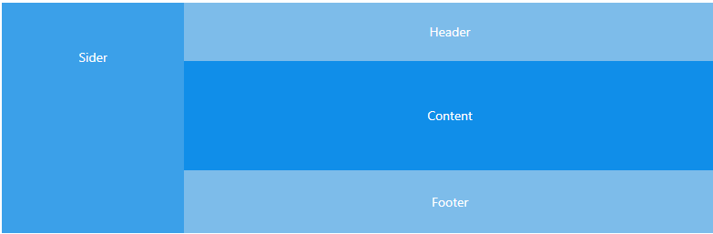

## 高阶函数

### 一类特别的函数

  - 接受函数类型的参数
  - 返回值时函数

### 常见的高阶函数

  - 定时器 setTimeout() / setInterval() 
  - Promise(() => {}) / then(resolve => {}, reject => {}) 
  - 数组遍历相关的方法 forEach() / filter() / map() / reduce() / find() / findIndex()
  - fn.bind() 
  - getFieldDecorator()

  ### 高阶函数的特点： 更加动态，更加扩展性

## 高阶组件

  理解： 

  - 本质就是一个函数
  - 包装一个组件（被包装组件），返回一个新组件（包装组件），包装组件会向被包装组件传入特定属性
  - 作用： 扩展组件的功能
  - 高阶组件也是一个高阶函数，接收一个组件函数，返回是一个新的组件函数

  面试：如果问到高阶组件，要联系高阶函数回答

## Form.validate

自定义  validator(rule, value, callback)，几个特点

- callback 必须返回
- callback() 验证成功
- callback(message) 验证失败，提示报错 message 信息

```jsx

validatePassword = (rule, value, callback) => {
    if (!value) {
      // callback 如果不传参代表校验成功，如果传参代表校验失败，并且会提示错误
      callback(' 必须输入密码')
    } else if (length < 4) {
      callback(' 密码必须大于 4  位')
    } else if (length > 12) {
      callback(' 密码必须小于 12  位')
    } else if (!pwdReg.test(value)) {
      callback(' 密码必须是英文、数组或下划线组成')
    } else {
      callback() // 必须调用 callback
    }
}

// ...
getFieldDecorator('userName', {
  rules: [
    {
      validator: this.validatePassword
    }
  ],
})(
  <Input />>
)

```

## PostMan 的使用

主要学会使用几个点：

- 注册登录 postman
- 测试不同类型的接口
  - 链接
  - 请求类型 POST,GET,PUT,OPTIONS 等
  - 输入测试数据 key, value
  - 数据发送 POST 请求放在 body 中，也就是 xxx-form-urlencoded 位置, GET 在 params 中，在 url 中带过去
  - 学会看响应数据，成功，失败，返回数据类型等。
- 保存在指定模块（文件夹）中，自定义命名

## async, await 的使用

- 作用：

  1. 简化 promise 的使用，不用再使用 .then() 来指定成功和失败的回调函数
  2. 以同步编码方式（没有回调函数）实现异步流程

- 哪里写 await ？

  在返回 promise 的表达式左侧写 await，目的是不想要 promise，但是要 promise 的异步执行成功的数据

- 哪里写 async？

  await 所在函数（最近的）定义的左侧写 async

  如下：

  ```jsx
  login = (e) => {
    // 阻止事件默认行为 ( 不提交表单 )
    e.preventDefault()
    // 进行表单所有控件的校验
    this.props.form.validateFields(async (err, values) => {
      if (!err) {
        // 校验成功
        const { username, password } = values
        const promise = await reqLogin(username, password)
        console.log(promise.data)
      }
    })
  }

  ```


## 使用 Promise 对 ajax 进行封装

ajax.js 模块

```jsx
/*
能发送 ajax 请求的函数模块
包装 axios
函数的返回值是 promise 对象
axios.get()/post() 返回的就是 promise 对象
返回自己创建的 promise 对象 :
统一处理请求异常
异步返回结果数据 , 而不是包含结果数据的 response
*/
import axios from 'axios'
import { message } from 'antd'
export default function ajax(url, data = {}, method = 'GET') {
  return new Promise(function (resolve, reject) {
    let promise
    // 执行异步 ajax 请求
    if (method === 'GET') {
      promise = axios.get(url, { params: data }) // params 配置指定的是 query 参数
    } else {
      promise = axios.post(url, data)
    }
    promise.then(response => {
      // 如果成功了 , 调用 resolve(response.data)
      resolve(response.data)
    }).catch(error => { // 对所有 ajax 请求出错做统一处理 , 外层就不用再处理错误了
      // 如果失败了 , 提示请求后台出错
      message.error(' 请求错误: ' + error.message)
    })
  })
}

```

## this.props.history.push 和 replace 的区别

当登录成功后，跳转页面，使用 push or replace ？

- push: 是一个栈结构，可以回退到跳转前的页面

- replace: 替换掉当前页面，无法返回原页面

```jsx
this.props.history.replace()
```

## 维持登录和自动登录

原方式登录：

- memoryUtils.js 存在内存中，缺点是 刷新页面后 user 失效

```jsx
// 存在内存中
export default {
  user: {}, // 保存当前登录 user
}
```

改进后，存储在 localStorage 里面

- storageUtils.js 存在 localStorage 里面

 代码为：
 
 ```jsx harmony
const USER_KEY = 'user_key'
export default {
    /*
    * 保存 user
    * 读取 user
    * 删除 user
    * */
    saveUser(user) {
        localStorage.setItem(USER_KEY, JSON.stringify(user.id))
    },

    getUser() {
        return JSON.parse(localStorage.getItem(USER_KEY || '{}'))
    },

    removeUser() {
        localStorage.removeItem(USER_KEY)
    }
}
```
- 更好的替代方案，使用 store
```bash
yarn add store
```

- 具体使用

```jsx
import store from 'store'
const USER_KEY = 'user_key'
export default {
    /*
    * 保存 user
    * 读取 user
    * 删除 user
    * */
    saveUser(user) {
        store.set(USER_KEY, user)
    },
    getUser() {
        return store.get(USER_KEY) || {}
    },
    removeUser() {
        store.remove(USER_KEY)
    }
}
```

- 将登录状态放在入口页面 index.js

```jsx harmony
import React from 'react';
import ReactDOM from 'react-dom';
import App from './App';
import storageUtils from "./utils/storageUtils";
import memoryUtils from "./utils/memoryUtils";

// 刷新页面的时候，从 localStorage 中获取 user，放入内存中
const user = storageUtils.getUser()
memoryUtils.user = user

ReactDOM.render(<App />, document.getElementById('root'));

```

- 已登录状态，避免重复登录，在登录页面需要跳转到首页

```jsx harmony
render() {
    const { getFieldDecorator } = this.props.form
    
    // 如果用户已经登录，自动跳转到管理页
    const user = memoryUtils.user
    if(user && user._id) {
      return <Redirect to='/' />
    }
}
```

## Admin 页面构建

- 页面结构


- admin.jsx 代码结构

```jsx harmony
/*
后台管理主路由组件
*/
import React, { Component } from 'react'
import { Redirect } from 'react-router-dom'
import { Layout } from 'antd';

import memoryUtils from '../../utils/memoryUtils'

const { Header, Footer, Sider, Content } = Layout;

export default class Admin extends Component {
  render() {
    const user = memoryUtils.user
    if(!user || !user._id) {
      return <Redirect to='/login' />
    }
    return (
        <Layout>
          <Sider>Sider</Sider>
          <Layout>
            <Header>Header</Header>
            <Content>Content</Content>
            <Footer>Footer</Footer>
          </Layout>
        </Layout>
    );
  }
}

```

更改优化后为：

```jsx harmony
/*
后台管理主路由组件
*/
import React, {Component} from 'react'
import {Redirect, Route, Switch} from 'react-router-dom'
import {Layout} from 'antd';

import memoryUtils from '../../utils/memoryUtils'

import Home from '../home/home'
import Role from '../role/role'
import User from '../user/user'
import Bar from '../charts/bar'
import Pie from '../charts/pie'
import Line from '../charts/line'
import Header from "../header/header"
import Product from '../product/product'
import LeftNav from "../left-nav/left-nav"
import Category from '../category/category'


const {Footer, Sider, Content} = Layout;

// 后台管理的路由组件

export default class Admin extends Component {
  render() {
    const user = memoryUtils.user
    if (!user._id) {
      return <Redirect to='/login'/>
    }
    return (
      <Layout style={{height: '100%'}}>
        <Sider>
          <LeftNav/>
        </Sider>
        <Layout>
          <Header>Header</Header>
          <Content style={{backgroundColor: 'white'}}>
            <Switch>
              <Route path='/home' component={Home}/>
              <Route path='/category' component={Category}/>
              <Route path='/product' component={Product}/>
              <Route path='/role' component={Role}/>
              <Route path='/user' component={User}/>
              <Route path='/charts/bar' component={Bar}/>
              <Route path='/charts/line' component={Line}/>
              <Route path='/charts/pie' component={Pie}/>
              <Redirect to='/home' />
            </Switch>
          </Content>
          <Footer style={{textAlign: 'center', color: '#aaaaaa'}}>推荐使用谷歌浏览器，
            可以获得更佳页面操作体验</Footer>
        </Layout>
      </Layout>
    )
  }
}

```

说明：

Content 里面，最后一个 `Redirect` 的意思，是指当进入页面后，没有匹配上前面的任何一个路由，则会刷新页面自动匹配到 `/home` 页

也可以理解为默认为 `/home` 页

** 此时，Content 页面显示效果为，上面 路由页面中的任意一个。 **

接下来，需要实现让左侧 Nav 的菜单栏在点击对应模块时，Content 也切换到该模块。

## LeftNav.jsx 菜单页

- menuConfig.js 菜单配置文件

简单实现方式为，在 menuItem 里面套一个 `Link`，即可实现点击跳转到对应页面

```jsx harmony
import React, {Component} from 'react'
import {Link} from 'react-router-dom'
import {Menu, Icon} from 'antd'

import logo from '../../assets/images/logo.png'
import './index.less'

const { SubMenu } = Menu

export default class LeftNav extends Component {
  render() {
    return (
      <div className="left-nav">
        <Link to='/'>
          <header className="left-nav-header">
            
            <h1>我的后台</h1>
          </header>
        </Link>
        <Menu theme="dark" defaultSelectedKeys={['1']} mode="inline">
          <Menu.Item key="/home">
            <Link to='/home'>
              <Icon type="pie-chart" />
              <span>首页</span>
            </Link>
          </Menu.Item>
          <SubMenu
            key="sub1"
            title={
              <span>
                  <Icon type="user" />
                  <span>User</span>
                </span>
            }
          >
            <Menu.Item key="/category">
              <Link to='/category'>
                品类管理
              </Link>
            </Menu.Item>
            <Menu.Item key="/product">
              <Link to='/product'>
                商品管理
              </Link>
            </Menu.Item>
          </SubMenu>
          <Menu.Item key="/user">
            <Link to='/user'>
              用户管理
            </Link>
          </Menu.Item>
          <Menu.Item key="/role">
            <Link to='/role'>
              角色管理
            </Link>
          </Menu.Item>
        </Menu>
      </div>
    )
  }
}
```

上面，是 ** 简单版 ** 实现方式，真正项目上为了便于管理，都是对路由进行配置，使用 ** 配置方式 ** 来对路由进行配置

接下来，我们定义路由配置文件 `config/menuConfig.jsx` 

代码为：

```jsx harmony
const menuList = [
  {
    title: ' 首页', // 菜单标题名称
    key: '/home', // 对应的 path
    icon: 'home', // 图标名称
  },
  {
    title: ' 商品',
    key: '/products',
    icon: 'appstore',
    children: [ // 子菜单列表
      {
        title: ' 品类管理',
        key: '/category',
        icon: 'bars'
      },
      {
        title: ' 商品管理',
        key: '/product',
        icon: 'tool'
      },
    ]
  },
  {
    title: ' 用户管理',
    key: '/user',
    icon: 'user'
  },
  {
    title: ' 角色管理',
    key: '/role',
    icon: 'safety',
  },
  {
    title: ' 图形图表',
    key: '/charts',
    icon: 'area-chart',
    children: [
      {
        title: ' 柱形图',
        key: '/charts/bar',
        icon: 'bar-chart'
      },
      {
        title: ' 折线图',
        key: '/charts/line',
        icon: 'line-chart'
      },
      {
        title: ' 饼图',
        key: '/charts/pie',
        icon: 'pie-chart'
      },
    ]
  },
]
export default menuList
```

除去内容，我们可以看到，其配置文件本质为一个数组，每一个 item 就是一个对象，也就是我们对应的菜单子项，这时，我们就可以书写 nav 的代码了

- LeftNav.jsx 左侧导航栏

首先，第一种方式，我们使用 `map + 递归` 的方式来实现

```jsx harmony
// 渲染菜单
getMenuNodes = (menuList) => {
    return menuList.map(item => {
      if(!item.children) {
        return (
          <Menu.Item key={item.key}>
            <Link to={item.key}>
              <Icon type={item.icon}></Icon>
              <span>{item.title}</span>
            </Link>
          </Menu.Item>
        )
      } else {
        return (
          <SubMenu
            key={item.key}
            title={
              <span>
                <Icon type={item.icon}></Icon>
                <span>{item.title}</span>
              </span>
            }
          >
            this.getMenuNodes(item.children)
          </SubMenu>
        )
      }
    })
  }

// ...

render() {
    return (
      <div className="left-nav">
        <Link to='/'>
          <header className="left-nav-header">
            
            <h1>我的后台</h1>
          </header>
        </Link>
        <Menu theme="dark" defaultSelectedKeys={['1']} mode="inline">
          {
            this.getMenuNodes(menuList)
          }
        </Menu>
      </div>
    )
  }
```

其次，可以使用 `reduce + 递归` 实现，原理为：

```js
array.reduce(function(total, currentValue[, currentIndex, arr]), initialValue)
```

代码为：

```jsx harmony
getMenuList = () => {
    return menuList.reduce((pre, item) => {
      if(!item.children) {
        pre.push((
          <Menu.Item key={item.key}>
            <Link to={item.key}>
              <Icon type={item.icon}></Icon>
              <span>{item.title}</span>
            </Link>
          </Menu.Item>
        ))
      } else {
        pre.push((
          <SubMenu
            key={item.key}
            title={
              <span>
                <Icon type={item.icon}></Icon>
                <span>{item.title}</span>
              </span>
            }
          >
            this.getMenuNodes(item.children)
          </SubMenu>
        ))
      }
  return pre // 切记要返回
    }, [])
  }
```

## 刷新页面停留在当前路由

在前面 leftNav 组件中，如果要实现刷新页面后还是停留在当前路由中，可以使用 `this.props.history.location.pathname` ，
但是，浏览器报错：** pathname of undefined **， 为什么？

因为当前组件不是 路由组件，

解决办法：

- `withRouter` 
- withRouter 是一个高阶组件，作用是 包装一个非路由组件，返回新组件
- 新组件向非路由组件传递3个属性：
    1. history
    2. location
    3. match

代码为：

```jsx harmony
import React, {Component} from 'react'
// 加上 withRouter
import {Link, withRouter} from 'react-router-dom'


class LeftNav extends Compoent{
  // ...
  render() {
    const path = this.props.match.pathname 
    return (
  // ...     
    <Menu theme="dark" defaultSelectedKeys={[path]} mode="inline">
      {
        this.getMenuNodes(menuList)
      }
    </Menu>
 ) 
   }
}
export default withRouter(LeftNav)

```

- 同时，注意一个坑：刷新页面后 path 获取错误？


因为 `defaultSelectedKeys` 这个属性，只会获取一次 path，当访问 `/user` 时，其匹配的先后顺序为 `/` 和 `/user`，因为 `defaultSelectedKeys` 作为默认值只会匹配一次，也就是前面的 `/` ，所以后面的 `/user`，无法获取到

解决办法： `selectedkeys` ，换成这个

同时，配合 默认展开， `defaultOpenKeys` 
```jsx harmony
<Menu theme="dark" selectedKeys={[path]} mode="inline">
  {
    this.getMenuNodes(menuList)
  }
</Menu>
```

## 自动打开子列表

- 需求：当刷新页面的时候，如果当前路径有子菜单，则自动打开当前 路径下的子菜单

- defaultOpenKeys 自动打开某个菜单

```jsx harmony
    <Menu theme="dark" selectedKeys={[path]} defaultOpenKeys={[]} mode="inline">
      {
        this.getMenuList(menuList)
      }
    </Menu>
```